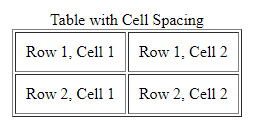
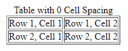

# Cell Padding

`Cell padding` হল `cell` এর `border` এবং `cell` এর মধ্যে ফাকা স্থান।

উদাহরণঃ
```html
<body>

  <table border="1" cellpadding="10">
    <caption>Table with Cell Spacing</caption>
    <tr>
      <td>Row 1, Cell 1</td>
      <td>Row 1, Cell 2</td>
    </tr>
    <tr>
      <td>Row 2, Cell 1</td>
      <td>Row 2, Cell 2</td>
    </tr>
  </table>

</body>
```

আউটপুটঃ



`cellpaddding` `0` হলে অউটপুটঃ


