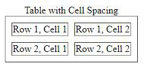

# Cell Spacing

`Cell spacing`  হচ্ছে প্রতিটি `cell` এর মধ্যকার দূরত্ব ।

Cell spacing এর একটি সাধারন উদাহরনঃ
```html
<body>

  <table border="1" cellspacing="10">
    <caption>Table with Cell Spacing</caption>
    <tr>
      <td>Row 1, Cell 1</td>
      <td>Row 1, Cell 2</td>
    </tr>
    <tr>
      <td>Row 2, Cell 1</td>
      <td>Row 2, Cell 2</td>
    </tr>
  </table>

</body>
```

আউটপুটঃ



 এই টেবিল টির `cellspacing` _attribute_ এর মান `10`  ।

`cellspacing` `0` দিলে যা হতোঃ 


